> Motivation: better describe and discriminate the timbral phenomena of singing voices from vocal pedagogy point of view. 
>
> Keywords: music perception and cognition, paralinguistic singing attribute recognition, timbre analysis

# SVQTD - Singing Voice Quality and Technique Database
## Introduction
SVQTD (Singing Voice Quality and Technique Database) is a classical tenor singing dataset collected from YouTube, it is mainly used to support supervised machine learning performing paralinguistic singing attribute recognition tasks. In SVQTD, there are nearly 4000 vocal solo segments with $4 - 20$ seconds long, totaling 10.7 hours. These segmenets are partitioned from 400 audios of 6 famous tenor arias. Furthermore, each segment is seperrately labeled on seven verbal scales corresponding to seven paralinguistic singing attributes widely used in vocal pedagogy. 

## Paralinguistic singing attributes selected

1. Chest Resonance

   - Annotation: During labeling, annotators assess each vocal segment and subjectively assess the extensity of chest resonance by a 4-class ordinal scale (from class 0 to class 3). For reference only, the class 4 for a group of singing voices that is darkest, strongest, and with strongest vibratory sensation compared with other singing voices in the dataset. Class 1 for a contrary situation. The judgment process is based on listeners music cognition and perception. 

   - Simple description: Strong chest resonance is related to a darker and deeper tone coloring and a sense of power, warmth, and sensuality.

   - Examplars:

     | Chest Resonance                    | Class 1                                                      | Class 3                                                      |
     | ---------------------------------- | ------------------------------------------------------------ | ------------------------------------------------------------ |
     | Spectrogram+forments visualization | 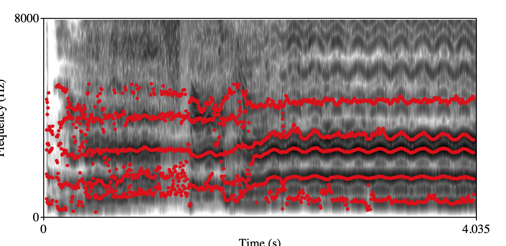                           | 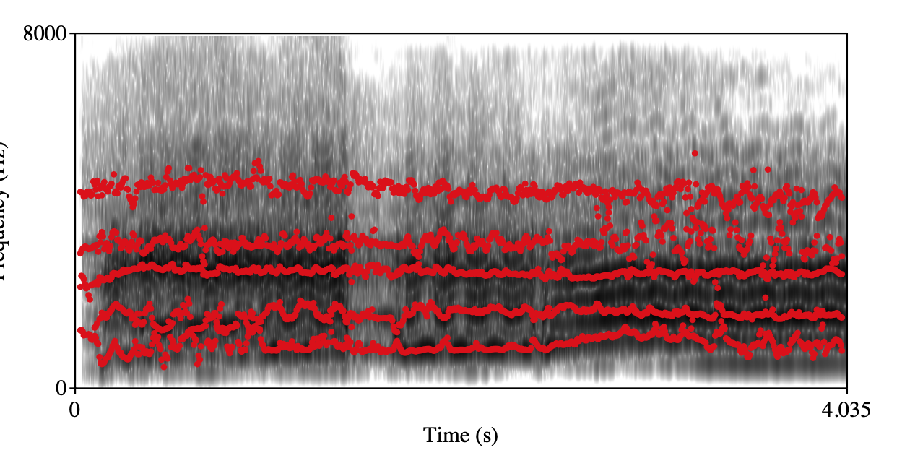                           |
     | audio                              | <audio controls="" autoplay="false" muted="true" name="media">     <source src="https://yanzexu.xyz/SVQTD/audio_examples/Chest_C2.wav" type="audio/mp3"> </audio> | <audio controls="" autoplay="false" muted="true" name="media">     <source src="https://yanzexu.xyz/SVQTD/audio_examples/Chest_C4.wav" type="audio/mp3"> </audio> |

2. Head Resonance

   - Annotation: During labeling, annotators are told to subjectively rate the 4-class ordinal scale of head voice from class 0 to 3 for the vocal segments. For reference only, class 3 for a group of singing voices with best head register technique which means smoothest and richest quality compared with other singing voices in the dataset. And class 0 for a contrary situation.

   - Simple description: Strong head resonance is related to a softer, richer, and smoother singing voice. 

   - Examplars:

     | Head Resonance                     | Class 0                         | Class 3                          |
     | ---------------------------------- | --------------------------------- | --------------------------------- |
     | Spectrogram+forments visualization |  |  |
     | audio                              | <audio controls="" autoplay="false" muted="true" name="media">     <source src="https://yanzexu.xyz/SVQTD/audio_examples/Chest_C2.wav" type="audio/mp3"> </audio> | <audio controls="false" autoplay="" muted="true" name="media">     <source src="https://yanzexu.xyz/SVQTD/audio_examples/Chest_C4.wav" type="audio/mp3"> </audio> |
     
     

3. Front Placement singing

   - Annotation: During labeling, listeners need to judge whether the singing segment is overly mask singing/forward placement singing with an obvious nasal quality based on a binary scale, 0 for without, 1 for with.

   - Examplars:

     | Overly front placement singing     | Class 0                                                      | Class 1                                                      |
     | ---------------------------------- | ------------------------------------------------------------ | ------------------------------------------------------------ |
     | Spectrogram+forments visualization | 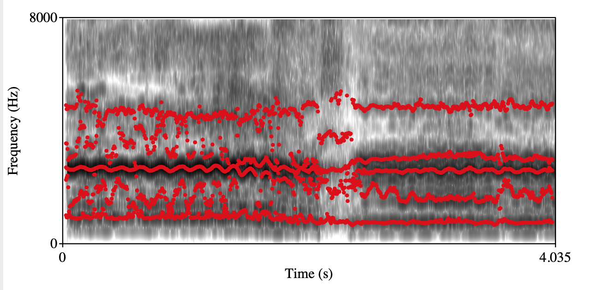                           | 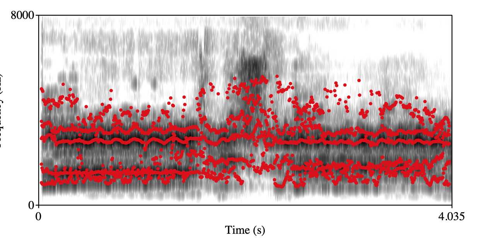                           |
     | audio                              | <audio controls="" autoplay="false" muted="true" name="media">     <source src="https://yanzexu.xyz/SVQTD/audio_examples/Front_C1.wav" type="audio/mp3"> </audio> | <audio controls="" autoplay="false" muted="true" name="media">     <source src="https://yanzexu.xyz/SVQTD/audio_examples/Front_C2.wav" type="audio/mp3"> </audio> |

4. Back placement singing

   - Annotation: Annotators need to subjectively judge whether the singing segment is "extreme" back placement singing which is characterized by uncomfortable swallowing quality based on a binary scale, 0 for without, 1 for with.

   - Examplars:

     | Overly  back placement singing     | Class 0                                                      | Class 1                                                      |
     | ---------------------------------- | ------------------------------------------------------------ | ------------------------------------------------------------ |
     | Spectrogram+forments visualization | 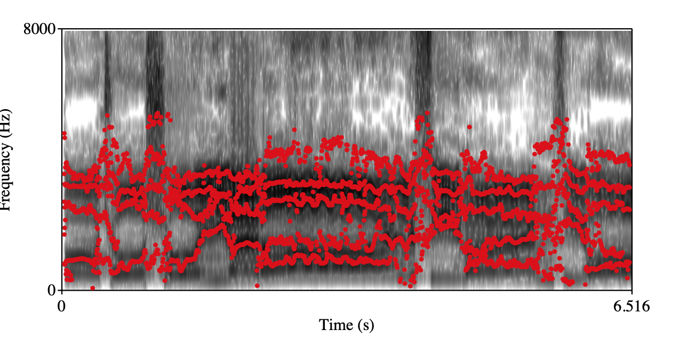                     | 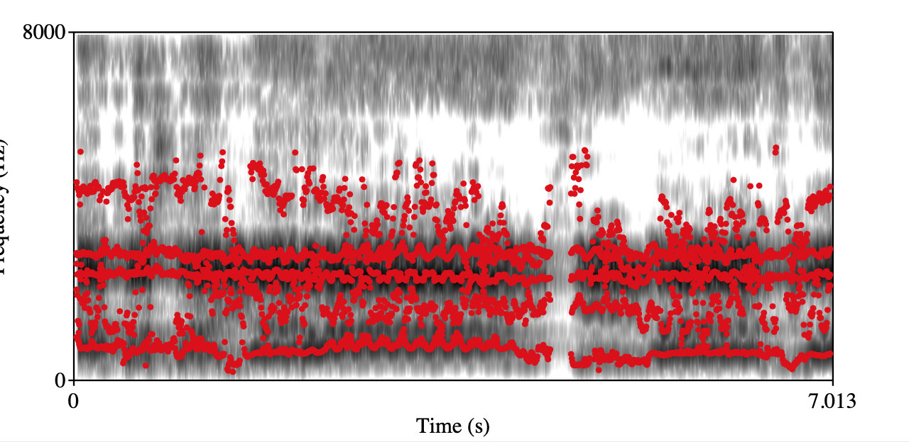                     |
     | audio                              | <audio controls="" autoplay="false" muted="true" name="media">     <source src="https://yanzexu.xyz/SVQTD/audio_examples/Back_C1.wav" type="audio/mp3"> </audio> | <audio controls="" autoplay="false" muted="true" name="media">     <source src="https://yanzexu.xyz/SVQTD/audio_examples/Back_C2.wav" type="audio/mp3"> </audio> |

5. Open throat/openness

   - Annotation: The open throat scale ranges from class 1 to 4. For reference only, level 1 for a group of singing voices that feel extremely uncomfortable, strained, narrow. And level 4 for a contrary situation.

   - Examplars:

     | Open throat                        | Class 0                    | Class 1                    |
     | ---------------------------------- | --------------------------------- | --------------------------------- |
     | Spectrogram+forments visualization | 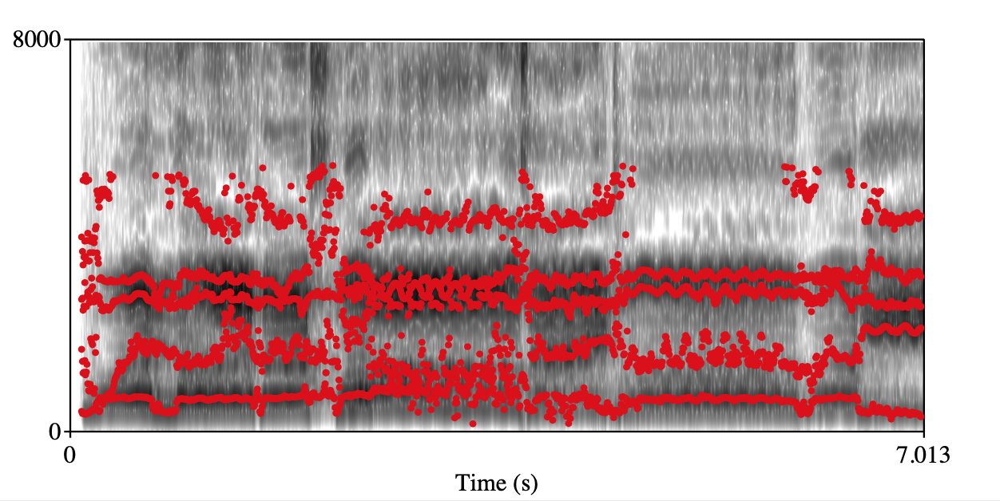 | 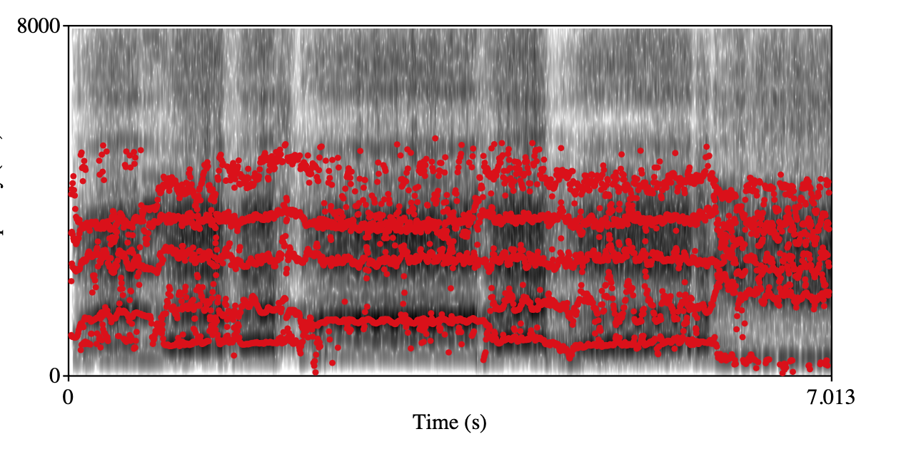 |
     | audio                              | <audio controls="" autoplay="false" muted="true" name="media">     <source src="https://yanzexu.xyz/SVQTD/audio_examples/Open_C1.wav" type="audio/mp3"> </audio> | <audio controls="" autoplay="false" muted="true" name="media">     <source src="https://yanzexu.xyz/SVQTD/audio_examples/Open_C4.wav" type="audio/mp3"> </audio> |

6. Roughness

   - Annotation: During labeling, annotators pay attention to judge whether there is apparent roughness in the vocal segment, 0 for without, 1 for with. 

   - Examplars:

     | Roughness                          | Class 0                                                      | Class 1                                                      |
     | ---------------------------------- | ------------------------------------------------------------ | ------------------------------------------------------------ |
     | Spectrogram+forments visualization | 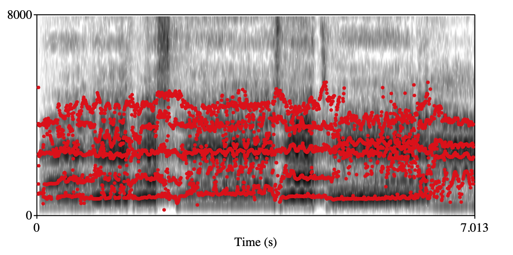                           | 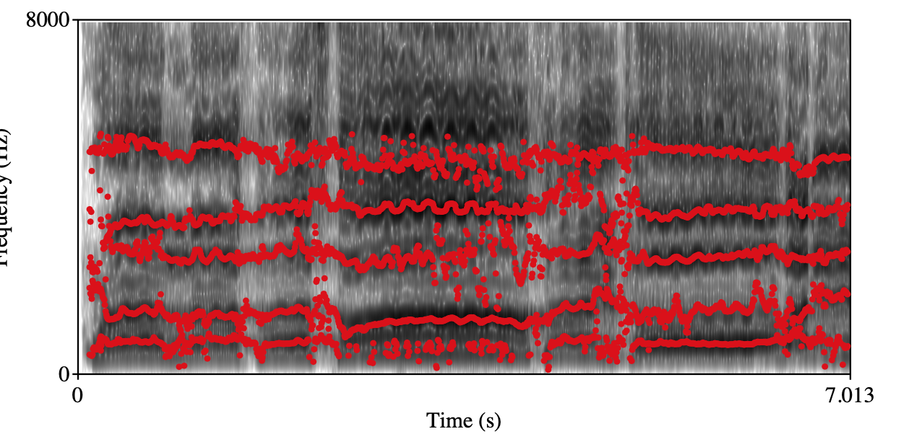                           |
     | audio                              | <audio controls="" autoplay="false" muted="true" name="media">     <source src="https://yanzexu.xyz/SVQTD/audio_examples/Rough_C1.wav" type="audio/mp3"> </audio> | <audio controls="" autoplay="false" muted="true" name="media">     <source src="https://yanzexu.xyz/SVQTD/audio_examples/Rough_C2.wav" type="audio/mp3"> </audio> |

7. Vibrato

   - Annotation: During labeling, the annotators should focus on the vibrato of vocal segments, rating segments as 0 for having no vibrato, 1 for having good vibrato, or 2 for having bad vibrato.

   - Simple discription: bad vibrato means very uncomfortable feeling, it is named as wobble or tremolo in vocal pedagogy. 

   - Examplars:

     | Vibrato                            | Class: 1                                                     | Class: 2                                                     |
     | ---------------------------------- | ------------------------------------------------------------ | ------------------------------------------------------------ |
     | Spectrogram+forments visualization | 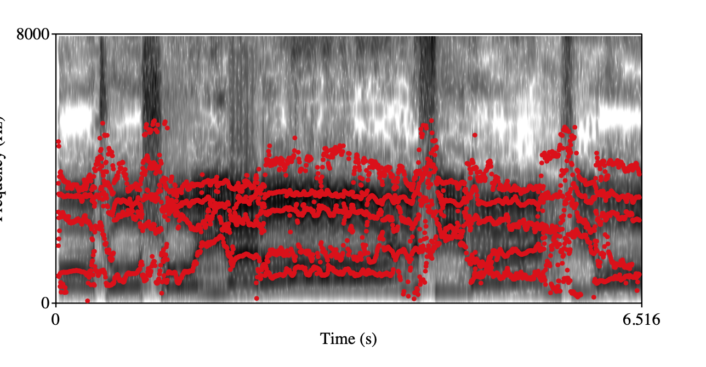                         | 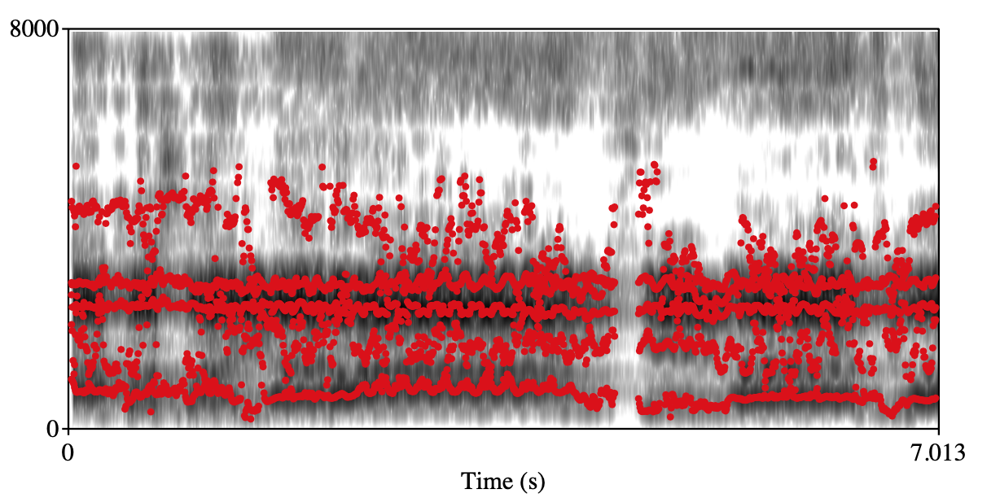                         |
     | audio                              | <audio controls="" autoplay="false" muted="true" name="media">     <source src="https://yanzexu.xyz/SVQTD/audio_examples/Vibrato_C2.wav" type="audio/mp3"> </audio> | <audio controls="" autoplay="false" muted="true" name="media">     <source src="https://yanzexu.xyz/SVQTD/audio_examples/Vibrato_C3.wav" type="audio/mp3"> </audio> |

## Production pipeline

* **STEP1**: We retrieved the top 100 amateur videos of six famous tenor arias from YouTube by appending the words "cover, student, or amateur" to the song names during the search. This enabled us to obtain videos from singers with varying levels of singing skills and expertise. All the videos were downloaded and converted to 16 kHz sampled waveform audio files (WAV). However, we manually removed audios that were too noisy, non-solo, or repetitive. It's important to note that we kept audios performed by the same singer but at different singing performances since singers may exhibit varying voice qualities and vocal techniques at different career stages.

* **STEP2**: We used an end-to-end music source separation model, spleeter, to extract vocal tracks from audio clips that typically contain accompaniment. Since our focus is solely on the timbral interaction between human listeners and singing voices, the accompaniment is deemed irrelevant to our task. 

* **STPE3**: Partition each vocal track to sentence-level vocal segments using energy-based VAD. By adjusting the energy threshold that decides whether a frame should be judged as silence and then remove the silence part, we can obtain partition audios to sentence-level vocal segments in $4-20$ seconds long. These sentence-level vocal segments are used for labeling. 

* **STEP4**: Subjectively label vocal segments for seven paralinguistic singing attributes. Seven annotators who have studied classical singing for more than three years in the music department of a college are recruited to annotate the vocal segments based on the labeling criteria defined. Before annotating, they went through a 10-hour training process to ensure that they were familiar with the paralinguistic singing attributes and have a relatively consistent understanding of how to label these data. Specifically, the 10-hour training process includes 2 hours for reviewing definitions of these attributes and 8 hours for practicing labeling the data. In the reviewing process, we firstly introduce them to the paralinguistic singing attributes with label criteria. They discuss together and exemplify some singers based on the label criteria. In the pre-labeling process, they are informed to formally annotate the data. And a supervisor is responsible to check 100 labeled vocal segments for each annotator. This behavior is for avoiding cheaters which means do not understand how to label or randomly label these data for saving time. Furthermore, the supervisor also should answer questions from annotators. During labeling, annotators found that the music source separation module may lead to degradation on some vocal segments. And the vocal segments that extremely interfere with the perceptual judgment are asked to remove from the dataset. Some typical bad samples caused by music source separation module are listed below: 

| Bad sample                                                   | Description                                                  |
| ------------------------------------------------------------ | ------------------------------------------------------------ |
| <audio controls="" autoplay="false" muted="true" name="media">     <source src="https://github.com/hackerpeter1/SVQTD/raw/page/audio_examples/bad_samples/--L3uqoQUV4/16.mp3"> </audio> | The background music is not separated and can be heard at the beginning. |
| <audio controls="" autoplay="false" muted="true" name="media">     <source src="https://github.com/hackerpeter1/SVQTD/raw/page/audio_examples/bad_samples/1eMtK2-0GOU/0.mp3"> </audio> | The background music is not separated and can be heard clearly. |
| <audio controls="" autoplay="false" muted="true" name="media">     <source src="https://github.com/hackerpeter1/SVQTD/raw/page/audio_examples/bad_samples/_yoQ2PMVMRY/17.mp3"> </audio> | The last whispering can not be heard clearly.                |
| <audio controls="" autoplay="false" muted="true" name="media">     <source src="https://github.com/hackerpeter1/SVQTD/raw/page/audio_examples/bad_samples/_bSHFUqcs8g/8.mp3"> </audio> | The Spleeter doesn't work for the low register, which means the background music is not separated and can be heard clearly. And it works too much for the highest register, especially the singing of the highest note can not be heard clearly. |
| <audio controls="" autoplay="false" muted="true" name="media">     <source src="https://github.com/hackerpeter1/SVQTD/raw/page/audio_examples/bad_samples/b5pkuOAzzVM%26list%3DPLcO-An1UmmHXT2NRraQU-EDf2sFkjFOJk%26index%3D15%26t%3D0s/14.mp3"> </audio> | Several singing vowels of high register can not be heard clearly. |

## Data Request
To download the released dataset, please:
1. Download the Agreement Sheet.pdf and sign it.
2. Send the PDF version of scanned Agreement Sheet with signature to yanze.xu@outlook.com. 
3. We will return an e-mail with download link to you as soon as possible.
  Kindly remind: using the proposed dataset, please cite:

> Xu, Y., Wang, W., Cui, H. *et al.* Paralinguistic singing attribute recognition using supervised machine learning for describing the classical tenor solo singing voice in vocal pedagogy. *J AUDIO SPEECH MUSIC PROC.* **2022**, 8 (2022). https://doi.org/10.1186/s13636-022-00240-z

## Epilogue

Our study represents an initial attempt at exploring paralinguistic singing attribute recognition. We express our appreciation for the valuable contributions of the annotators who provided their opinions, as well as the singers who offered their performances. Moving forward, we intend to pursue further research in this area. 