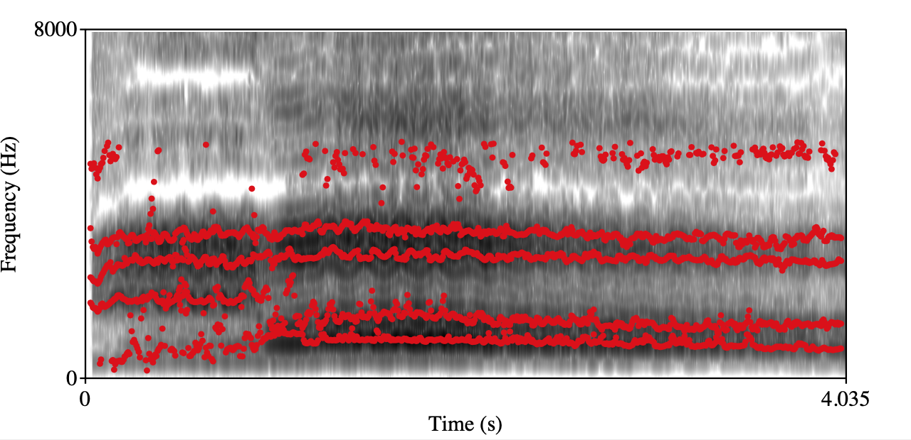

> A dataset to better describe and discriminate the timbral phenomena of classical tenor singing voices from vocal pedagogy point of view.

# SVQTD - Singing Voice Quality and Technique Database
## Introduction
SVQTD (Singing Voice Quality and Technique Database) is a classical tenor singing dataset collected from YouTube for performing paralinguistic singing attribute recognition tasks. In the SVQTD, there are nearly 4000 vocal solo segments with $4 - 20$ seconds long, totaling 10.7 hours. And they are partitioned from four hundred audios that are download from YouTube by searching the names of six famous tenor arias. Furthermore, each segment is labeled on seven verbal scales corresponding to seven paralinguistic singing attributes, respectively. 

## Seven paralinguistic singing attributes

1. Chest Resonance

   - Typical vocal color: It is related to a darker and deeper tone coloring and a sense of power, warmth, and sensuality.

   - Annotation: During labeling, annotators assess each vocal segment and subjectively assess the extensity of chest resonance by a 4-class ordinal scale. For reference only, the 4 for a group of singing voices that is darkest, strongest, and with strongest vibratory sensation compared with other singing voices in the dataset. Level 1 for a contrary situation. The judgment process is based on listeners music cognition and perception. 

   - Typical example pairs:

     | Chest Resonance                    | Class: 2                           | Class: 4                           |
     | ---------------------------------- | ---------------------------------- | ---------------------------------- |
     | Spectrogram+forments visualization |  |  |
     | audio                              | [Click](./audio_examples/Chest_C2.wav)  | [Click](./audio_examples/Chest_C4.wav)  |

2. Head Resonance

   - Typical vocal color: It is primarily related to a softer, richer, and smoother singing voice

   - Annotation: During labeling, the annotators are told to subjectively rate the 4-class ordinal scale of head voice from 1 to 4 for the vocal segments. For reference only, 4 for a group of singing voices with best head register technique which means smoothest and richest quality compared with other singing voices in the dataset. And level 1 for a contrary situation.

   - Typical example pairs:

     | Head Resonance                     | Class: 1                          | Class: 4                          |
     | ---------------------------------- | --------------------------------- | --------------------------------- |
     | Spectrogram+forments visualization |  |  |
     | audio                              | [Click](./audio_examples/Head_C1.wav)  | [Click](./audio_examples/Head_C4.wav)  |

3. Front Placement singing

   - Typical vocal color: Nasal quality

   - Annotation: During labeling, listeners need to judge whether the singing segment is mask singing/forward placement singing with an obvious nasal quality based on a binary scale, 0 for without, 1 for with.

   - Typical example pairs:

     | Front Placement singing            | Class: 1                           | Class: 2                           |
     | ---------------------------------- | ---------------------------------- | ---------------------------------- |
     | Spectrogram+forments visualization |  |  |
     | audio                              | [Click](./audio_examples/Front_C1.wav)  | [Click](./audio_examples/Front_C2.wav)  |

4. Back placement singing

   - Typical vocal color: Swallowed quality

   - Annotation: During labeling, annotators need to subjectively judge whether the singing segment is "extreme" back placement singing which is characterized by uncomfortable swallowing quality based on a binary scale, 0 for without, 1 for with.

   - Typical example pairs:

     | Back Placement singing             | Class: 1                                 | Class: 2                                 |
     | ---------------------------------- | ---------------------------------------- | ---------------------------------------- |
     | Spectrogram+forments visualization |  |  |
     | audio                              | [Click](./audio_examples/Back_C1.wav)         | [Click](./audio_examples/Back_C2.wav)         |

5. Open throat/openness

   - Typical vocal color: N/A 

   - Annotation: The open throat scale ranges from 1 to 4. For reference only, level 1 for a group of singing voices that feel extremely uncomfortable, strained, narrow. And level 4 for a contrary situation.

   - Typical example pairs:

     | Open throat                        | Class: 1                          | Class: 4                          |
     | ---------------------------------- | --------------------------------- | --------------------------------- |
     | Spectrogram+forments visualization |  |  |
     | audio                              | [Click](./audio_examples/Open_C1.wav)  | [Click](./audio_examples/Open_C4.wav)  |

6. Roughness

   - Typical vocal color: N/A 

   - Annotation: During labeling, annotators pay attention to judge whether there is apparent roughness in the vocal segment, 0 for without, 1 for with. 

   - Typical example pairs:

     | Roughness                          | Class: 1                           | Class: 2                           |
     | ---------------------------------- | ---------------------------------- | ---------------------------------- |
     | Spectrogram+forments visualization |  |  |
     | audio                              | [Click](./audio_examples/Rough_C1.wav)  | [Click](./audio_examples/Rough_C2.wav)  |

7. Vibrato

   - Typical vocal color: N/A 

   - Annotation: During labeling, the annotators should focus on the vibrato of vocal segments, rating segments as 0 for having no vibrato, 1 for having good vibrato, or 2 for having bad vibrato.

   - Typical example pairs:

     | Vibrato                            | Class: 2                             | Class: 3                             |
     | ---------------------------------- | ------------------------------------ | ------------------------------------ |
     | Spectrogram+forments visualization |  |  |
     | audio                              | [Click](./audio_examples/Vibrato_C2.wav)  | [Click](./audio_examples/Vibrato_C3.wav)  |

## Production pipeline

1. Download videos from YouTube. The top 100 amateur videos of six famous tenor arias are retrieved from YouTube. To obtain the videos from singers who have different singing skills and levels of expertise, the words `cover|student|amateur' is appended to the song name to search for videos. All of the downloaded videos are converted to 16 kHz sampled waveform audio files (WAV). Moreover, we manually remove audios that are too noisy, non-solo, and repetitive. Note that we keep audios sang by the same singer but performed at different times. The reason is that singers may have different voice qualities and use different vocal techniques at different career stages.

2. Extract vocal tracks using end-to-end music source separation model. The solo audio clips are often with accompaniment. However, the accompaniment is irrelevant to our task because we only focus on the timbral interaction between human listeners and singing voices. We achieve it by using the end-to-end music source separation model spleeter.

3. Partition each vocal track to sentence-level vocal segments using energy-based VAD. By adjusting the energy threshold that decides whether a frame should be judged as silence and then remove the silence part, we can obtain partition audios to sentence-level vocal segments in $4-20$ seconds long. These sentence-level vocal segments are used for labeling. 

4. Subjectively label vocal segments for seven paralinguistic singing attributes. Seven annotators who have studied classical singing for more than three years in the music department of a college are recruited to annotate the vocal segments based on the labeling criteria defined. Before annotating, they went through a 10-hour training process to ensure that they were familiar with the paralinguistic singing attributes and had a relatively consistent understanding of them. Since music source separation may lead to degradation on some vocal segments, annotators are responsible for removing bad segments that strongly interfere with their judgment. There are still some bad samples that are inevitably affected by the music source separation model but annotators think it does not affect the decision-make process. We list some typical examples in the below table. 

   | Bad sample                                                   | Description                                                  |
   | ------------------------------------------------------------ | ------------------------------------------------------------ |
   | [Click](./audio_examples/bad_samples/_bSHFUqcs8g/8.mp3)      | The Spleeter doesn't work for the low register and works 'too much for the highest note, the highest note can not be heard clearly. |
   | [Click](./audio_examples/bad_samples/_yoQ2PMVMRY/17.mp3)     | The last whispering can not be heard.                        |
   | [Click](./audio_examples/bad_samples/--L3uqoQUV4/16.mp3)     | The Spleeter doesn't work, background music can be heard.    |
   | [Click](./audio_examples/bad_samples/1eMtK2-0GOU/0.mp3)      | The Spleeter doesn't work, background music can be heard.    |
   | [Click](./audio_examples/bad_samples/b5pkuOAzzVM&list=PLcO-An1UmmHXT2NRraQU-EDf2sFkjFOJk&index=15&t=0s/14.mp3) | Several vowels of high register can not be heard.            |

## Download
To download the released dataset, please:
1. Download the Agreement Sheet.pdf and sign it.
2. Send the PDF version of scanned Agreement Sheet with signature to yanze.xu@outlook.com. 
3. We will return an e-mail with download link to you as soon as possible.
Kindly remind: using the proposed dataset, please cite:
(undone)

Note
Since the dataset contains 4,000 vocal segments extracted from about 400 unique YouTube audios. To avoid the data leakage, we make sure segments in the train set and validation set are from different arias. However, we can not make sure that they are from different persons because we can not get singer's identity for each video. We suggest you to keep the original partition.